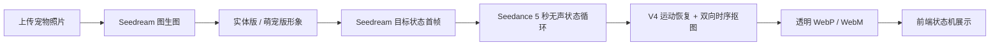

# 宠物 3D 动效生成 MVP

这是把当前“宠物照片生成 3D 动效形象”方案、代码、前端 Demo、提示词和样例产物整理到一起的独立项目目录。

> **当前唯一生产方案：V4**
> 生成端使用 `airgap_motion_v4`，抠图端使用自研运动 alpha 恢复 + 双向时序稳定，实体版最终边缘对比为 `1.18`。默认视频为 720P / 5 秒 / 24fps / 无声，透明 WebP 为 640px。完整参数与复现方式见 [V4 生产方案](docs/PRODUCTION_V4.md)。

目标能力：

- 上传一张宠物照片，自动生成两版形象：实体版和萌宠版。
- 每版生成无声循环状态资产：`idle`（静息）、`fast_walk`（快走，合并走动/奔跑表现）、`sleep`（睡眠）。
- 使用 Seedream 做图生图形象生成，Seedance 做视频动作生成，本地完成抠图、透明 WebP 合成和前端展示。
- 前端只做页面内预览，不触发浏览器下载。

## 目录

```text
.
├── petavatar_server.py       # 本地上传生成 API + 静态预览服务
├── poc.py                    # 生成主流程：stylize / state_frames / animate / matte
├── prompts.py                # Seedream / Seedance 提示词集中维护
├── prompt_config/            # 动作可编辑层 + 锁定生产约束
├── serve_poc_output.py       # 只预览 poc_output 的轻量静态服务
├── inputs/                   # 样例输入图和上传图
├── poc_output/               # 前端页面和已生成的最终动效资产
└── docs/                     # 需求、方案、状态机和上下文记忆
```

## 运行

1. 准备 Python 3.10+ 和 ffmpeg。
2. 安装依赖：

```bash
pip install -r requirements.txt
```

3. 复制 `.env.example` 为 `.env`，填入火山方舟 Ark Key：

```bash
ARK_API_KEY=your_ark_key_here
```

4. 启动完整上传生成服务：

```bash
python petavatar_server.py --host 127.0.0.1 --port 8792
```

5. 打开：

```text
http://127.0.0.1:8792/paimomo_compare.html
```

只看已有产物，不跑生成：

```bash
python serve_poc_output.py --host 127.0.0.1 --port 8792
```

## 当前链路



## 关键约束

- 不提交 `.env`，API Key 只放本地环境变量或本地 `.env`。
- `generate_audio` 必须保持 `false`，生成无声视频。
- WebP 是展示资产，不能再触发下载。
- 只修改动作时编辑 `prompt_config/actions.py`；不要修改 `prompt_config/locked.py` 中的绿幕、构图、身份和 API 约束。
- `sleep`、`fast_walk` 按“硬件状态已发生后的稳定循环”生成，不做入睡、起步、停止、醒来等过渡过程。
- 中间帧和 raw 视频默认忽略，避免 git 仓库膨胀。
- 上传原图会保存两份：`inputs/<pet_id>.<ext>` 作为全局索引，`poc_output/<pet_id>/uploaded_original.<ext>` 作为结果目录内副本。历史展示优先读取结果目录内副本，避免迁移或分享时出现“上传原图未找到”。

## 文档入口

- [V4 生产方案](docs/PRODUCTION_V4.md)
- [历史实验清理记录](docs/CLEANUP_20260715.md)
- [需求说明](docs/REQUIREMENTS.md)
- [四大状态与提示词方案](docs/STATE_AND_PROMPT_STRATEGY.md)
- [项目记忆](docs/MEMORY.md)
