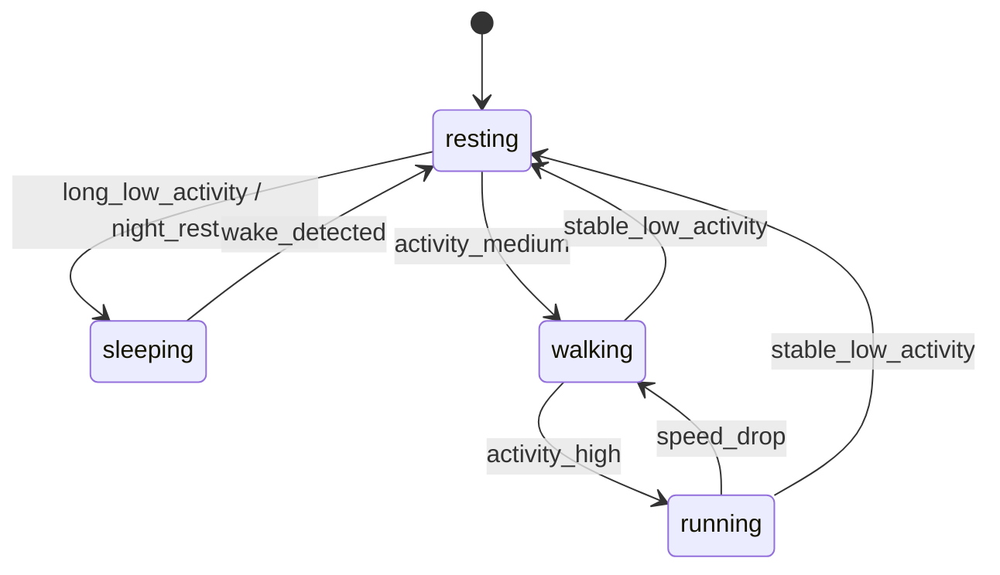

# 四大状态与 3D 动效提示词方案

> 2026-07-10 实现口径：算法层仍可区分走动与奔跑，但展示资产已合并为 `fast_walk`。当前实际生成入口只有 `idle / fast_walk / sleep`；下文四状态内容保留为传感器与未来扩展设计参考。

## 总体原则

算法状态只保留四类：静息、睡眠、行走、奔跑。动画可以丰富，但不能让动画动作反向污染算法分类。

静息是健康采集主状态。静息里的眨眼、耳动、尾巴轻摆、舔毛、嗅闻、歪头等都归入“静息动作池”，只是表现层动作，不新增算法状态。

## 状态机



| 状态 | 动画策略 | 传感器策略 |
|---|---|---|
| 静息 | 基础呼吸循环 + 加权随机小动作 | PPG/心率/呼吸开启，IMU 低频用于伪影剔除 |
| 睡眠 | 已睡眠状态循环，不做入睡/醒来过渡 | 低功耗或睡眠监测模式 |
| 行走 | 原地行走循环 | IMU/GNSS 工作，静息心率采集关闭 |
| 奔跑 | 原地奔跑循环 | IMU 高频，GNSS 高频，静息采集关闭 |

## 静息动作池

静息动作分两层：

| 层级 | 动作 | 采样建议 |
|---|---|---|
| 采集安全动作 | 呼吸起伏、眨眼、耳朵轻动、尾巴尖轻摆、鼻子嗅动 | 可在采样窗口播放 |
| 静息表现动作 | 舔爪、洗脸、舔毛、歪头、打哈欠、伸懒腰、换趴姿、甩头 | 仍属静息，但采样窗口应暂停或剔除 |

调度建议：

- 基础静息循环常驻。
- 每 8-20 秒抽取一次动作池。
- 同一动作不能连续重复。
- 每个动作有冷却时间。
- 用户打开 App 时，可提高“看向用户、摇尾、歪头”的权重。
- 长时间静息后，可提高“打哈欠、伸懒腰、入睡”的权重。

## 全局提示词

```text
基于参考宠物照片，生成同一只宠物的 3D 动效形象。
必须保持宠物的毛色、花纹、脸型、眼睛颜色、耳朵形状、体型比例一致。
移动 App 展示用，完整全身入镜，固定正面 3/4 视角，镜头不移动，宠物位于画面中心。
透明背景或纯绿色背景，方便后续抠图合成 WebP。
无文字、无道具、无场景、无其他动物、无人的手。
动作自然、连续、无跳帧、无突然切回初始姿态。
```

## 全局负面提示词

```text
不要改变宠物身份，不要变换毛色花纹，不要变胖变瘦，不要新增项圈或衣服。
不要切换镜头，不要拉近拉远，不要改变背景，不要裁切身体。
不要多只宠物，不要多余肢体，不要畸形爪子，不要闪烁，不要突然回到首帧。
不要大幅位移，不要漂浮，不要平面 2D 纸片感，不要毛发边缘硬边。
```

## 静息基础循环

```text
生成静息状态基础循环动画。
宠物保持坐姿或趴姿，身体稳定，只有非常轻微的呼吸起伏。
偶尔自然眨眼，眼神看向用户，耳朵有轻微生命感。
动作幅度很小，适合健康采集期间展示。
首帧和尾帧姿态几乎一致，可以无缝循环。
持续 4 秒，24fps，安静、克制、真实、有陪伴感。
```

## 猫静息小动作

```text
猫处于静息状态，保持同一坐姿或趴姿。
先维持轻微呼吸，然后慢慢眨眼一次，耳朵轻轻动一下，尾巴尖小幅摆动。
动作结束后自然回到初始静息姿态。
整体动作安静、克制、像真实猫，不要兴奋，不要大幅移动。
首尾姿态一致，可无缝接回静息基础循环。
```

## 狗静息小动作

```text
狗处于静息状态，保持坐姿或趴姿。
身体轻微呼吸，眨眼，鼻子轻轻嗅动，尾巴小幅摇动 1-2 次。
可以轻微歪头看向用户，但不要站起来，不要跳跃。
动作结束后回到原来的静息姿态。
整体亲近、回应主人，但仍然是低活动静息状态。
```

## 睡眠状态循环

当前产品不再拆入睡或醒来过渡。原因是 App 收到硬件睡眠信号时，宠物在现实中通常已经入睡；前端只需要直接展示“已睡着”的稳定循环。醒来时由状态机切回 `idle`，不额外生成醒来过渡。

正式资产只保留 `sleep`。旧的入睡流程和醒来流程入口已删除，不再作为生成或页面展示能力。

```text
sleep 睡眠状态循环：视频第一帧就已经是宠物睡着后的稳定姿态，宠物趴着、侧躺或自然蜷缩睡觉。
双眼闭合，表情放松，头部靠近前爪或轻轻侧放，尾巴自然贴在身体旁边。
整段只保留轻微规律的睡眠呼吸起伏，偶尔耳朵或爪子轻轻抽动一下。
动作非常安静，首帧和尾帧完全接近，可以长时间无缝循环。
不要展示从坐姿趴下、从站姿倒下、打哈欠入睡、抬头醒来、睁眼、起身、翻身、走动或任何入睡/醒来过渡。
不要出现床、毯子、宠物窝、碗、食物、人手或其他道具。
```

## 行走与奔跑

行走：

```text
生成宠物行走状态循环动画。视频第一帧就已经是宠物正在自然行走的状态，不展示从静息站起来、起步或停下。
宠物保持同一身份和 3D 形象，固定正面 3/4 视角，全身入镜。
四肢按自然步态循环移动，身体有轻微上下起伏，尾巴和耳朵随步态自然摆动。
宠物不要真的走出画面，不要改变镜头，不要改变体型。
首帧和尾帧必须保持行走步态连续，可以无缝循环；不要在结尾切回坐姿或静息姿态。
```

奔跑：

```text
生成宠物奔跑状态循环动画。视频第一帧就已经是宠物正在奔跑或小跑的状态，不展示从静息启动、加速或刹停。
动作比行走更快，四肢有清晰奔跑节奏，身体有更明显但自然的弹跳。
尾巴、耳朵、毛发随动作轻微摆动。
宠物保持画面中心，不要冲出画面，不要切换镜头。
首帧和尾帧必须保持奔跑步态连续，可以无缝循环；不要在结尾切回坐姿或静息姿态。
整体表现兴奋、有活力，但不要夸张变形。
```

## 建议数据结构

```json
{
  "state": "resting",
  "action": "blink_ear_tail",
  "species": "cat",
  "duration_sec": 3,
  "weight": 16,
  "cooldown_sec": 40,
  "sampling_safe": true,
  "loop": false,
  "return_to": "resting_base"
}
```
